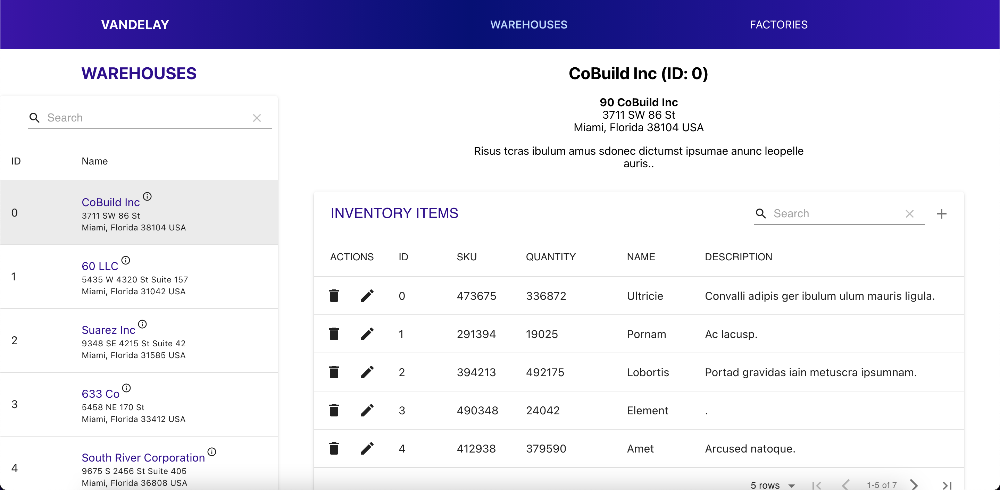
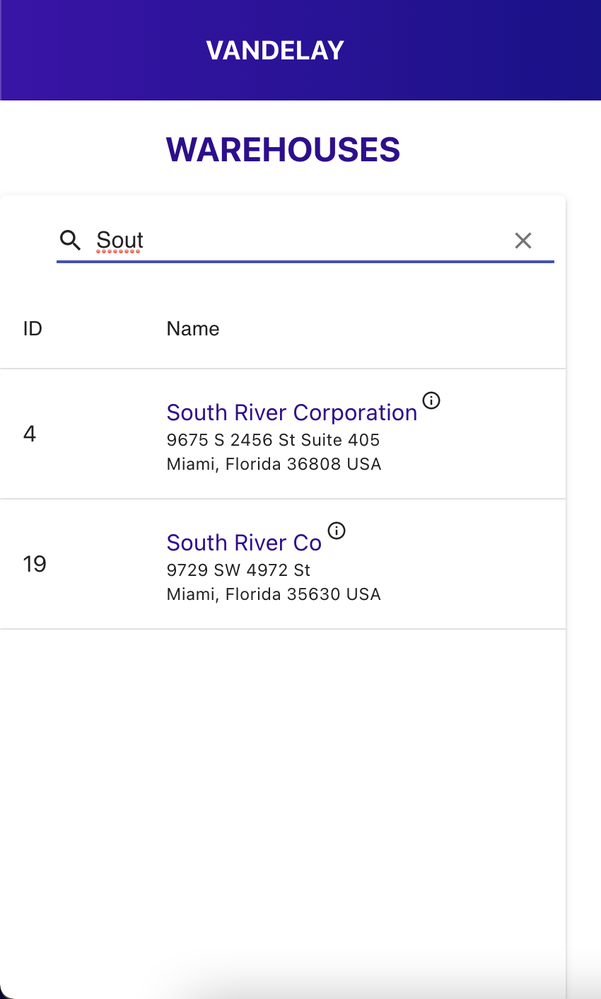
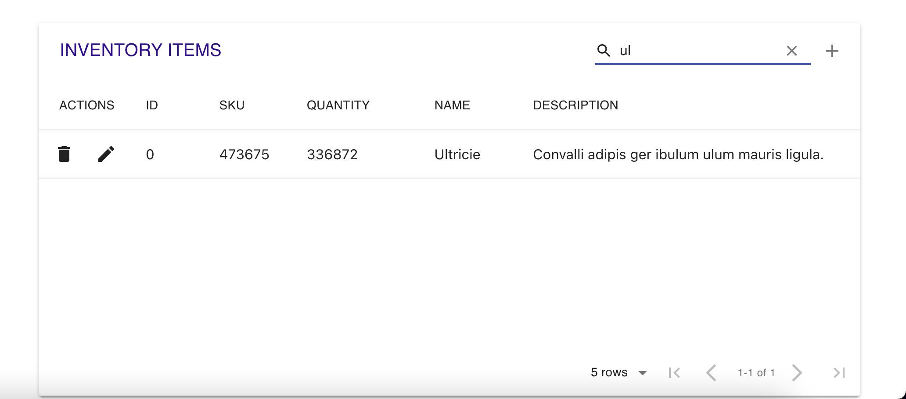
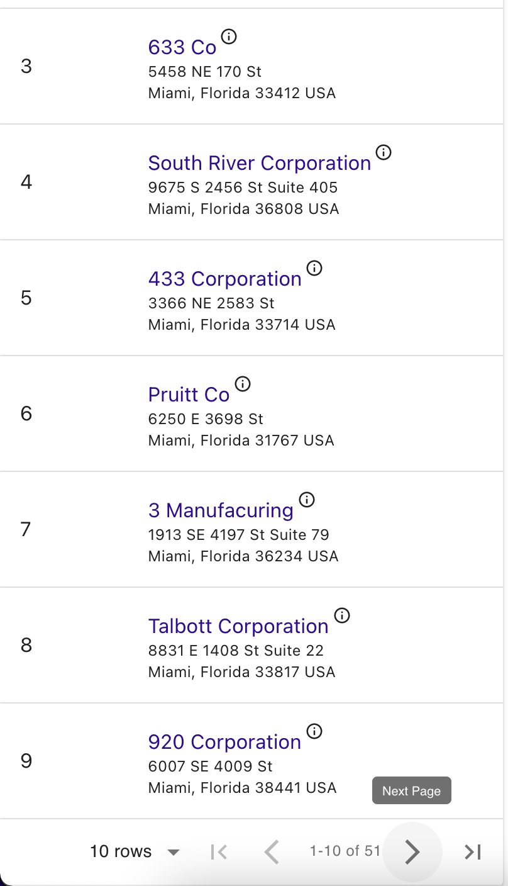
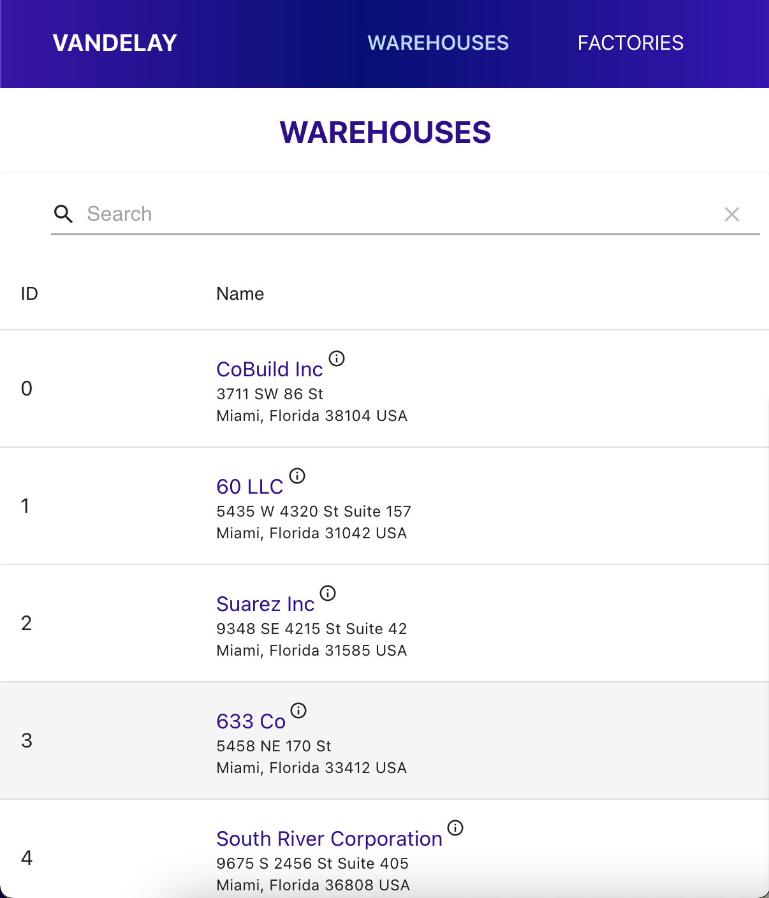
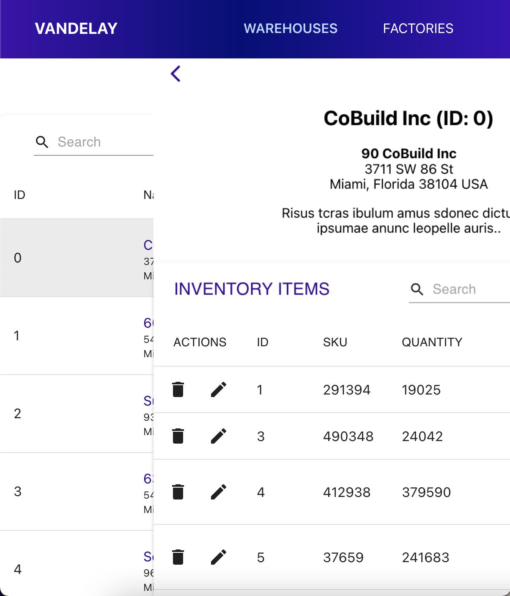
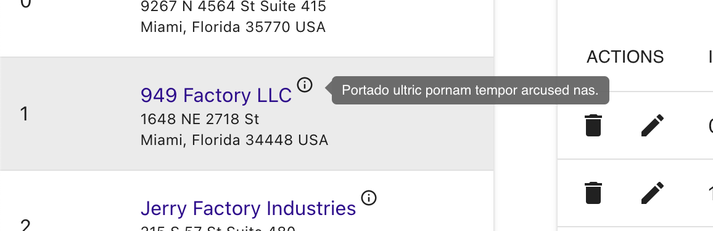

# VANDELAY WAREHOUSE AND FACTORY MANAGEMENT APP

## Table of Contents

- [About](#About)
- [UI](#UI)
- [Dependencies](#Dependencies)
- [Contact](#Contact)

## About

This application allows a user to view Warehouse and Factory data along with either Inventory or Machine data. A user can easily toggle between factory and warehouse modes via links in the nav bar.

All data is displayed in grids and is searchable as well as paginated.

Within a given Factory or Warehouse detail, users can Add, Edit, and Delete existing Inventory Items or Machines.

After every action, a snackbar appears.

On mobile and other smaller screens, only a list of either Warehouses or Factories appears. Once a warehouse or factory is selected, its corresponding details and inventory or machine data slides in.

See the deployed app [here](https://reyesdmusic.github.io/vandelay/).

## UI

Desktop

## 

Search

## 

## 

Pagination

## 

Mobile

## 

Slide Detail

## 

Snackbar

## 

Tool Tips

## 

## Dependencies

[React](https://reactjs.org/) was used to create the UI. The following libraries comprise bits and pieces of functionality:

- [material ui](https://mui.com/)
- [material-table](https://material-table.com/#/)
- [redux](https://redux.js.org/)
- [react-redux](https://react-redux.js.org/)

## Contact

### Danny Reyes

- [GitHub](https://github.com/reyesdmusic)
- [LinkedIn](https://www.linkedin.com/in/danny-reyes-dev/)
- email: vdannyreyesdev@gmail.com
